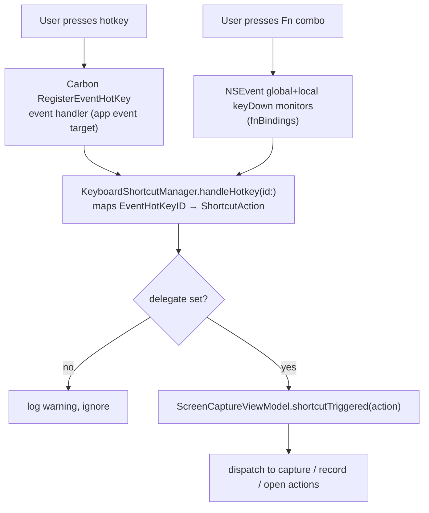

# Shortcuts & URL Scheme Automation

Global keyboard shortcuts, in-overlay capture shortcuts, Annotate editor shortcuts, conflict detection, the cheat-sheet overlay, and the `snapzy://` deep-link route table.

Verified against `Snapzy/Services/Shortcuts/`, `Snapzy/Features/Shortcuts/`, `Snapzy/Features/Annotate/Services/AnnotateShortcutManager.swift`, `Snapzy/App/SnapzyDeepLinkHandler.swift`, `Snapzy/Services/Capture/CaptureOverlayShortcutSettings.swift` at HEAD (`v2.1.0-beta.1`).

## Global shortcut mechanism



- Engine: `KeyboardShortcutManager.shared` (`Snapzy/Services/Shortcuts/KeyboardShortcutManager.swift`) — Carbon `RegisterEventHotKey` / `UnregisterEventHotKey`; hotkey IDs use signatures `ZSF1`…`ZSFN` (`0x5A53_46xx`).
- Config model: `ShortcutConfig { keyCode: UInt32, modifiers: UInt32 }` (Carbon modifiers), persisted as JSON in UserDefaults under per-shortcut keys (`fullscreenShortcut`, `areaShortcut`, `recordingShortcut`, …).
- Fn modifier: custom bit `ShortcutConfig.functionCarbonModifier = 0x2000`. Carbon `RegisterEventHotKey` cannot express Fn, so Fn-containing configs are **not** Carbon-registered — they are collected into `fnBindings` and dispatched via global+local `NSEvent` keyDown monitors (`updateFnMonitors()` / `handleFnKeyDown`), matched exactly (keyCode + full modifier set incl. Fn) by `ShortcutConfig.matches(event:)`. Fn-only combos (e.g. `fn+F3`) and Fn+modifier combos (e.g. `fn+⌘+F3`) both fire; the non-Fn sibling combo is never hijacked.
  - Requires Accessibility permission (global key monitors silently deliver nothing without it) — the Shortcuts settings tab shows a hint row when an Fn binding exists but `AXIsProcessTrusted()` is false (`KeyboardShortcutManager.hasFnBoundShortcuts`).
  - Monitors are passive: unlike Carbon hotkeys, the frontmost app still receives the keystroke.
  - Monitors are installed only while `shouldRegisterShortcuts` holds and at least one Fn binding exists; temporary suppression (shortcut recording) removes them.
- Delegate: `KeyboardShortcutDelegate.shortcutTriggered(ShortcutAction)` — implemented by `ScreenCaptureViewModel` (`Snapzy/Features/Capture/CaptureViewModel.swift`).
- Global enable: `shortcutsEnabled` UserDefaults flag; `enable()` / `disable()` re-register everything. Restored at init if previously enabled.
- Temporary suspension: `beginTemporaryShortcutSuppression()` / `endTemporaryShortcutSuppression()` — refcounted, unregisters hotkeys without touching the persisted enabled flag (used while recording shortcut input).
- Recording-session gating: the four recording-session kinds (`pauseResumeRecording`, `togglePenRecording`, `restartRecording`, `deleteRecording`) hold a global registration **only while a recording session is active** (`ScreenRecordingManager.shared.isActive`). The manager observes `ScreenRecordingManager.shared.$state` and re-registers when session activity toggles (`shouldRegisterNow(for:)`), so those combos stay free for other apps while Snapzy is idle; Fn-based session bindings likewise stay out of `fnBindings` while idle. `recording` itself is **not** gated — it starts recordings and must stay global.
  - The observer acts on the **emitted** state value, never on a fresh `isActive` read inside the sink: `@Published` delivers on `willSet`, so a property re-read inside the sink observes the stale pre-transition value and registration would run one transition behind (session hotkeys missing during recordings, combos left held after they end — issue #517). The emitted value is parked in `sessionActivityOverride` for the duration of the refresh it triggers.
- Per-shortcut disable set: `shortcuts.disabledGlobalActions` (`PreferencesKeys.disabledGlobalShortcuts`).
- Cleared/unbound set: `shortcuts.clearedGlobalActions` (`PreferencesKeys.clearedGlobalShortcuts`) — `shortcut(for:)` returns `nil` for cleared kinds.

## Global shortcut table

All 21 `GlobalShortcutKind`s with shipping defaults (verified in `KeyboardShortcutManager.swift`):

| Kind | Action | Default |
| --- | --- | --- |
| `fullscreen` | Capture Fullscreen | ⌘⇧3 |
| `area` | Capture Area | ⌘⇧4 |
| `repeatArea`| Repeat Area Screenshot| ⌃⌘⇧4|
| `areaAnnotate` | Capture Area & Annotate | ⌘⇧7 |
| `activeWindow` | Capture Active Window | ⌘⇧9 |
| `scrollingCapture` | Scrolling Capture | ⌘⇧6 |
| `recording` | Record Screen (start/stop toggle) | ⌘⇧5 |
| `ocr` | Capture Text (OCR) | ⌘⇧2 |
| `smartElement` | Capture Smart Element | ⌥⇧4 |
| `objectCutout` | Object Cutout | ⌘⇧1 |
| `annotate` | Open Annotate | ⌘⇧A |
| `videoEditor` | Open Video Editor | ⌘⇧E |
| `cloudUploads` | Cloud Uploads window | ⌘⇧L |
| `shortcutList` | Shortcut cheat sheet overlay | ⌘⇧K |
| `history` | History panel toggle | ⌘⇧H |
| `pauseResumeRecording` | Pause/Resume recording | **unbound** (recommended ⌘⇧Space) |
| `togglePenRecording` | Toggle pen overlay while recording | **unbound** |
| `restartRecording` | Restart current recording | **unbound** |
| `deleteRecording` | Delete in-progress recording | **unbound** |
| `delayedCapture` | Delayed Capture (countdown, then frozen area selection) | **unbound** |
| `delayedFullscreen` | Delayed Fullscreen (countdown, then fullscreen screenshot) | **unbound** |

- The six unbound-by-default kinds are seeded into the cleared set on first launch (`seedDefaultClearedShortcutsOnFirstLaunchIfNeeded`) so they never shadow existing user config. `pauseResumeRecordingShortcut` keeps the recommended ⌘⇧Space as its backing value, but resolves to `nil` via `shortcut(for:)` until the user binds it.
- Editing UI: Settings → Shortcuts (see [PREFERENCES.md](PREFERENCES.md)).

## Overlay shortcuts (in-overlay, not plain global hotkeys)

`CaptureOverlayShortcutSettings` (`Snapzy/Services/Capture/CaptureOverlayShortcutSettings.swift`):

- Two kinds: `applicationCapture` and `applicationRecording`; both default to single key **A** with no modifiers (child mode).
- Child mode (modifiers == 0): pressed *inside* the area-selection / recording overlay to switch to application-window mode. Menu bar items show it as a suffix of the parent shortcut.
- Independent mode (modifiers ≠ 0): registered as its own global hotkey (`applicationCaptureHotkeyRef` / `applicationRecordingHotkeyRef`) firing `.captureApplication` / `.recordApplication`.
- Keys: `shortcuts.area.applicationCapture`, `shortcuts.recording.applicationCapture`.
- During an area-screenshot selection, **Return** instantly completes with the last selected area (per-session opt-in `allowsRepeatAreaCompletion`; OCR/cutout selections are unaffected). See [CAPTURE.md](CAPTURE.md).
- During a recording selection, **Return** or keypad **Enter** toggles whole-display mode: the display under the pointer is highlighted and a click records it. The key is fixed (not remappable) and ignored with ⌘/⌥/⌃ held. A plain click without Enter also selects the display under the pointer. See [RECORDING.md](RECORDING.md#picking-a-target-in-the-recording-overlay).

## Recording-behavior notes

- `recording` shortcut is a start/stop toggle: `toggleRecordingFromShortcut` stops the active recording (`RecordingCoordinator.stopFromStatusItem()`) or starts the recording flow otherwise.
- `pauseResumeRecording` no-ops unless a recording is active (`state.isPauseResumeEligible` guard, logged when ignored).
- `togglePenRecording` no-ops unless `RecordingCoordinator.shared.isActive`.

## Recording annotation tool shortcuts

While recording annotations are enabled, hold the configured annotation shortcut modifier (Shift by default) and press a tool key to switch tools. `RecordingAnnotationOverlayWindow` routes key-down events through `RecordingAnnotationState` using `charactersIgnoringModifiers`, with a local monitor for events addressed to Snapzy and a global monitor for events addressed to the recorded app. Matching local events are consumed; global monitors are passive and cannot suppress the recorded app's keystroke, and external-app delivery requires Accessibility permission. The visible tool set is selection, rectangle, oval, arrow, line, pencil, and highlighter.

## Quick Access card action shortcuts (hover-scoped)

`QuickAccessActionShortcutStore` (`Snapzy/Features/QuickAccess/Models/QuickAccessActionShortcutStore.swift`) +
`QuickAccessHoverShortcutRegistry` (`Snapzy/Features/QuickAccess/Services/QuickAccessHoverShortcutRegistry.swift`).

Hover a Quick Access card, press the key, the card runs that action. All seven `QuickAccessActionKind`s are bound:

| Action | Default | Key |
| --- | --- | --- |
| `copy` | ⌘C | `quickAccess.action.shortcut.copy` |
| `saveOrOpen` | ⌘S | `quickAccess.action.shortcut.saveOrOpen` |
| `edit` | ⌘E | `quickAccess.action.shortcut.edit` |
| `uploadToCloud` | ⌘U | `quickAccess.action.shortcut.uploadToCloud` |
| `pinToScreen` | ⌘P | `quickAccess.action.shortcut.pinToScreen` |
| `delete` | ⌘⌫ | `quickAccess.action.shortcut.delete` |
| `dismiss` | ⌘W | `quickAccess.action.shortcut.dismiss` |

- Master toggle `quickAccess.action.shortcuts.enabled` (default on); per-action disable set `quickAccess.action.shortcuts.disabled`. Cleared bindings persist the `"null"` sentinel so they do not fall back to the default on reload.
- **Delivery**: a session-level `CGEventTap` is installed when the first card is hovered and removed 250ms after hover ends. The tap converts each key-down to `NSEvent` and compares the complete key code + modifier set via `ShortcutConfig.matches(event:)`; only an exact registered binding is consumed. Every unregistered combination — including `⌘⇧P` when the card binding is `⌘P` — is returned unchanged to the focused app. This replaces the previous Carbon-by-action-ID path with an explicit exact-match/pass-through boundary. If Accessibility is unavailable, the code falls back to passive global/local `NSEvent` monitors: they never consume events, and external-app delivery/action triggering is best-effort because macOS may withhold those events. The panel is a `.nonactivatingPanel` with `canBecomeKey == false`, so keyboard events never route to it.
- **Because these shadow the frontmost app while registered, teardown is mandatory** on every path: hover exit, card `onDisappear`, panel hide (`hidePanel`), `suspendForCapture()`, and item removal (`items` didSet → `invalidateHoverIfItemGone`, covering cards pulled out from under the pointer by the countdown or an opening editor). `QuickAccessManager.setHoveredItem` is the single writer of `hoveredItemID`.
- **Dispatch**: the registry never executes actions. It publishes `(itemID, action)` through `QuickAccessManager.cardShortcutTrigger`; `QuickAccessCardView` receives it and calls its existing `performAction`, so keyboard, click, context menu, and swipe share one path and one set of availability rules (cloud configured, upload in flight, video vs screenshot).
- **Validation** (`ShortcutValidationService.validateQuickAccessActionShortcut`): requires one of ⌘/⌥/⌃ (reject); rejects Fn (the Quick Access router only accepts regular modifier+key bindings); rejects duplicates inside this namespace; **warns** on collision with an enabled global shortcut, which an exact card binding may consume during hover. Collisions with Annotate keys are allowed — the two are never simultaneously active.
- Card tooltips append the binding (`actionHelpText`), and the ⇧⌘K cheat sheet lists all seven rows.
- Separate from `quickAccess.openEditorShortcut` ("Edit latest capture", ⌘↩, off by default), which is panel-scoped and targets the newest card regardless of hover.

## Annotate editor shortcuts

`AnnotateShortcutManager` (`Snapzy/Features/Annotate/Services/AnnotateShortcutManager.swift`):

- 14 tool single-key shortcuts (`AnnotationToolType.defaultShortcut`, remappable): crop, selection, rectangle, filledRectangle, oval, arrow, line, text, highlighter, blur, spotlight, counter, watermark, pencil. (`mockup` excluded — internal only.)
- Tool keys stored per-tool under prefix `annotate.shortcut.`; per-tool disable set `shortcuts.disabledAnnotateToolShortcuts`.
- Action shortcuts (`AnnotateActionShortcutKind`, modifier combos as `ShortcutConfig`):

  | Kind | Default | Key |
  | --- | --- | --- |
  | `copyAndClose` | ⌘⇧C | `annotate.action.copyAndClose` |
  | `toggleSidebar` | ⌘B | `annotate.action.toggleSidebar` |
  | `togglePin` | ⌃⌘P | `annotate.action.togglePin` |
  | `cloudUpload` | ⌘U | `annotate.action.cloudUpload` |
  | `autoRedactSensitiveData` | unbound | `annotate.action.autoRedactSensitiveData` |

- Action disable set: `shortcuts.disabledAnnotateActionShortcuts`.

## Conflict detection

`ShortcutValidationService` (`Snapzy/Services/Shortcuts/ShortcutValidationService.swift`):

- Cross-namespace duplicate checks (global ↔ annotate action ↔ independent overlay ↔ annotate tool): duplicate → `.reject` with `.error` severity, blocks assignment.
- System screenshot conflicts: `SystemScreenshotShortcutManager` reads `com.apple.symbolichotkeys` via `UserDefaults(suiteName:)` (requires the shared-preference entitlement — see [APP_LIFECYCLE.md](APP_LIFECYCLE.md)). Symbolic hotkey IDs: 28 (save area), 29 (copy area), 30 (save screen), 31 (copy screen), 184 (screenshot options).
- Only `fullscreen`, `area`, `repeatArea`, `recording` are `isSystemConflictRelevant`; conflicts surface as `.warning` (accepted, non-blocking). `repeatArea` ships as ⌃⌘⇧4, which collides with macOS symbolic hotkey 29 (copy area to clipboard) on default systems — the warning UI covers it.
- Prompt-once flow: `systemShortcutsDisablePromptSeen` UserDefaults flag gates the "disable macOS shortcuts" prompt; unreadable plist → assume no conflict (no nag).

## Shortcut cheat sheet overlay

- `ShortcutOverlayManager` (`Snapzy/Features/Shortcuts/ShortcutOverlayManager.swift`) — full-screen borderless `NSPanel` (`.screenSaver` level, joins all spaces), content from `ShortcutOverlayContentBuilder.buildSections()` (`Snapzy/Features/Shortcuts/ShortcutOverlayModels.swift`).
- Open/toggle: ⇧⌘K, menu bar → Keyboard Shortcuts, or `snapzy://show/shortcuts`. Blocked while recording (`RecordingCoordinator.shared.isActive` guard).
- Esc closes (local + global monitors); "Open Settings" deep-links to Settings → Shortcuts.

## URL scheme automation

Scheme: `snapzy://` (registered in `Snapzy/Resources/Info.plist` `CFBundleURLTypes`).

Gate: `urlSchemeEnabled` (default `true`; Settings → Advanced → URL Scheme integration). Disabled or unknown routes are logged and ignored.

Dispatch: AppleEvent `kAEGetURL` → `AppDelegate` (queued pre-launch) → `AppCoordinator.handleDeepLink` → `SnapzyDeepLinkHandler` (`Snapzy/App/SnapzyDeepLinkHandler.swift`); routes parsed by `SnapzyDeepLinkAction.init?(url:)`.

### Canonical route table

| Route | Action |
| --- | --- |
| `snapzy://capture/fullscreen` | Capture fullscreen |
| `snapzy://capture/area` | Capture area |
| `snapzy://capture/repeat-area`| Repeat last area capture|
| `snapzy://capture/delayed` | Delayed Capture (countdown → area). `?mode=fullscreen` captures the whole display instead |
| `snapzy://capture/delayed-fullscreen` | Delayed Fullscreen (countdown → fullscreen screenshot) |
| `snapzy://capture/application` | Application-window capture |
| `snapzy://capture/active-window` | Capture active window |
| `snapzy://capture/area-annotate` | Capture area → Annotate |
| `snapzy://capture/scrolling` | Scrolling capture |
| `snapzy://capture/ocr` | OCR capture |
| `snapzy://capture/smart-element` | Smart Element capture |
| `snapzy://capture/object-cutout` | Object cutout |
| `snapzy://record/screen` | Start screen recording |
| `snapzy://record/application` | Application-window recording |
| `snapzy://open/annotate` | Open empty Annotate editor |
| `snapzy://open/combine` | Combine images (see params below) |
| `snapzy://open/video-editor` | Open empty Video Editor |
| `snapzy://open/cloud-uploads` | Toggle Cloud Uploads window |
| `snapzy://open/history` | Toggle History panel |
| `snapzy://show/shortcuts` | Toggle shortcut cheat sheet |
| `snapzy://settings` / `snapzy://settings?tab=<tab>` | Open Settings, optionally to a tab |

- `open/combine` query params: repeat `?file=` with absolute paths; ≥2 valid files → combines directly, otherwise opens the combine picker (`CombineImagesCoordinator.presentPicker()`). Example:

  ```sh
  open 'snapzy://open/combine?file=/tmp/first.png&file=/tmp/second.png'
  ```

- Settings tabs: `general`, `capture`, `annotate`, `quick-access`, `history`, `shortcuts`, `permissions`, `cloud`, `advanced`, `about`. Also accepted as path form (`snapzy://settings/capture`).
- Aliases exist for most routes — e.g. `capture/focused-window`, `capture/window`, `record/window`, `screenshot/area`, `ocr`, `annotate`, `combine`, `uploads`, `history`, `shortcuts`, `preferences`, plus tab aliases (`screenshots`, `privacy`, `config`, `toml`, …). Full alias list: `SnapzyDeepLinkAction.init?(url:)` in `Snapzy/App/SnapzyDeepLinkHandler.swift`.

## Related docs

- [APP_LIFECYCLE.md](APP_LIFECYCLE.md) — deep-link dispatch, entitlements, menu bar
- [PREFERENCES.md](PREFERENCES.md) — Shortcuts tab reference
- [CAPTURE.md](CAPTURE.md) — capture flows triggered by shortcuts
- [RECORDING.md](RECORDING.md) — recording start/stop/pause behavior
- [ANNOTATE.md](ANNOTATE.md) — editor tools and actions
- [CONFIGURATION.md](CONFIGURATION.md) — TOML control of shortcut prefs
